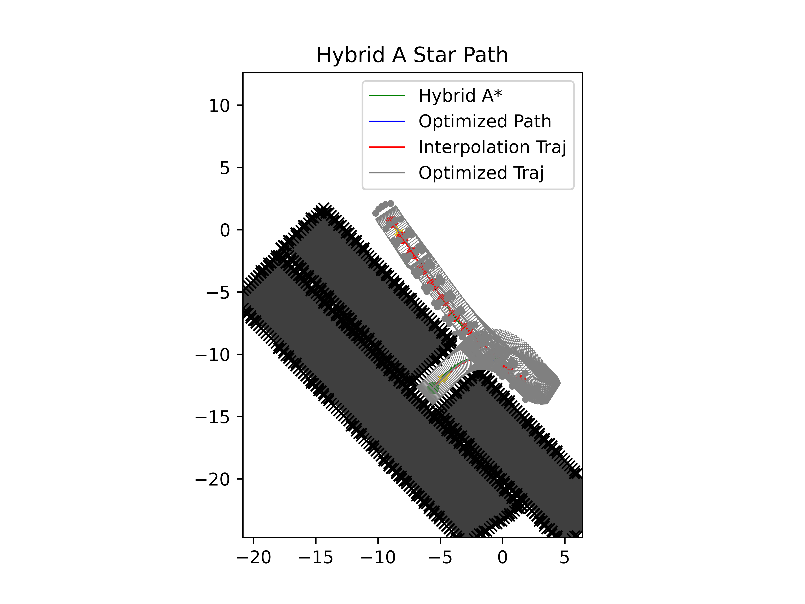
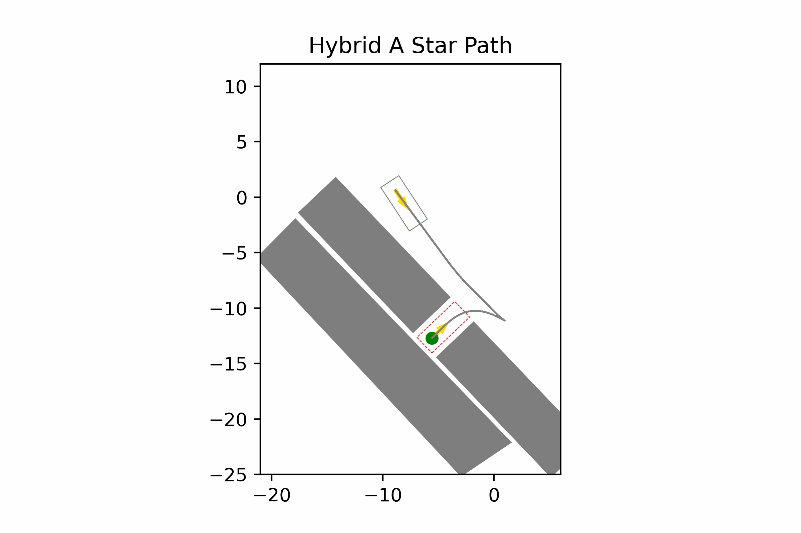

# Automated Valet Parking
## 1. Introduction
This repo is developed based on [Wenqing's project](https://github.com/wenqing-2021/AutomatedValetParking). This readme only documents major changes made based on the original project. So for more details (system requirement, data structure, etc.) about this project, please visit the original project's page.

## 2. Usage
Run the following commands to install **requirements**
```
pip install -r requirements.txt

conda install -c conda-forge ipopt
```
---
Run *draw.py* to draw the **map** of a certain case (default Case1)
```
python draw.py [--case_name=Case1]
```
Replace `Case1` with the benchmark case you want to draw.

---
Run *main.py* to show the **animation** process
```
python main.py [--case_name=Case1]
```
Again, replace `Case1` with the benchmark case you want to test.

## 3. Development log








