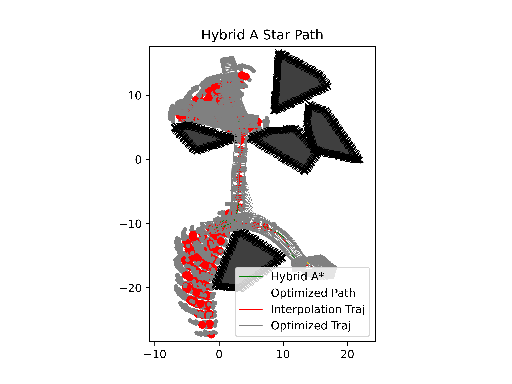
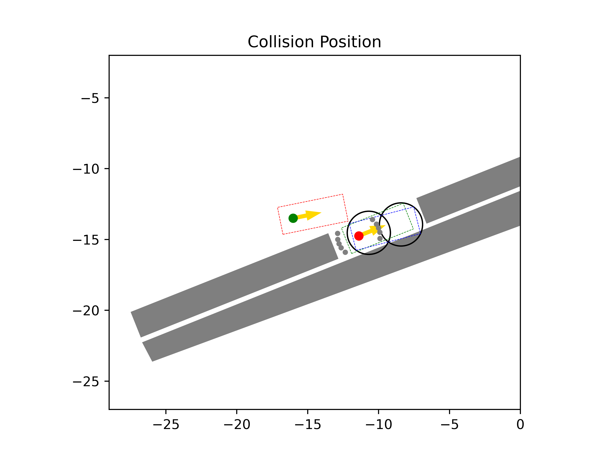

# Automated Valet Parking
## 1. Introduction
The purpose of this repo is to document my progress in this project.

This repo is developed based on [Wenqing's project](https://github.com/wenqing-2021/AutomatedValetParking). This readme only documents major changes made based on the original project. So for more details (system requirement, data structure, etc.) about this project, please visit the original project's page.

## 2. Usage
Run the following commands to install **requirements**
```
pip install -r requirements.txt

conda install -c conda-forge ipopt
```
---
Run *draw.py* to only draw the **map** of a certain case (default Case1)
```
python draw.py [--case_name=Case1]
```
Replace `Case1` with the benchmark case you want to draw.

---
Run *main.py* to show both the map and the **animation** process
```
python main.py [--case_name=Case1]
```
Again, replace `Case1` with the benchmark case you want to test.

## 3. Development Log

### 3.1 Visualization tools
#### 3.1.1 Draw Map
The `draw.py` draws only the maps of benchmark cases and saves them as CaseXMap.png. This facilitates debugging process by visualizing the benchmark cases.

Case 11 Map             |  Case 35 Map
:----------------------:|:----------------------:
 | 

As you can see, the initial position is indicated by the green rectangle and the goal indicated by the red one, with arrows indicating car's directions.

Drawing out maps gives us valuable information. E.g. Case 11 requires the car to find the parking slot in an open space after passing through obstacles, whereas Case 35 requires the car to park straight into a parking slot.

#### 3.1.2 Exploration Tracking
I also added the exploration tracking feature. During the animation, now we can see how the program is exploring the map in real time. 

The explored node is marked in red, and the small grey nodes are the nodes in the "open list" (neighbors waiting to be explored). 
Case 30 Exploration Start |  Case 16 Exploration End
:------------------------:|:----------------------:
 | 

This feature is helpful because it shows us how the program explores the map and where our resources are spent. E.g. In Case 16, although our program finally reaches the goal (following grey trace), it first explored in the wrong direction towards the top of the map.

### 3.2 Efficiency Improvement
By adjusting the heuristic calculation and cost configurations, I could further improve the search efficiency since my last commit.
- Case 9

Exploration Before | Exploration After
:-----------------:|:-----------------:
 | 
 | 

- Case 10

Exploration Before | Exploration After
:-----------------:|:-----------------:
 | 
 | 

### 3.3 Collision Check
After experimenting, I found a reason why some exploration never ends. In some cases, the parking slot is too small, so the car may never be able to enter it since the car tries to avoid the obstacles in a grid map. The following are two examples of this situation
Case 27 Collision | Case 30 Collision
:-----------------:|:-----------------:
 | 
The car isn't able to enter/exit the parking slot, since it's already considered as "collided" by only standing in the parking slot. | When the car tries to move in any direction, a collision occurs.

This problem could be relieved to some extent by reducing the `dt` and `trajectory_dt` in `config.yaml`, so that more and closer nodes can be explored in the map. However, this would lead to a much larger amount of calculation.

### 3.4 Future Improvement
The current program sometimes generates unnatural turbulences in the planned paths:
Case 14 | Case 18
:-----------------:|:-----------------:
 | 

I am looking into the `path_plan` folder to try to find a solution.
