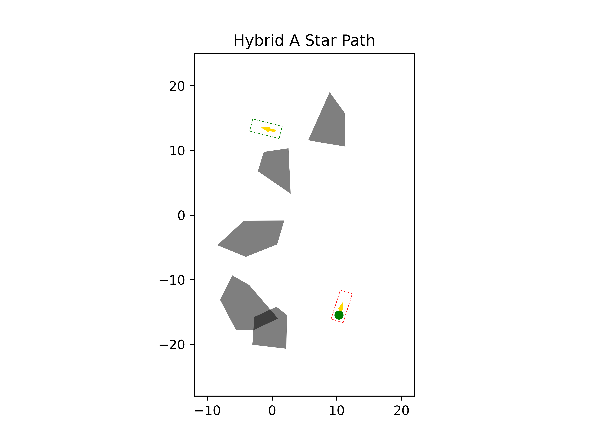
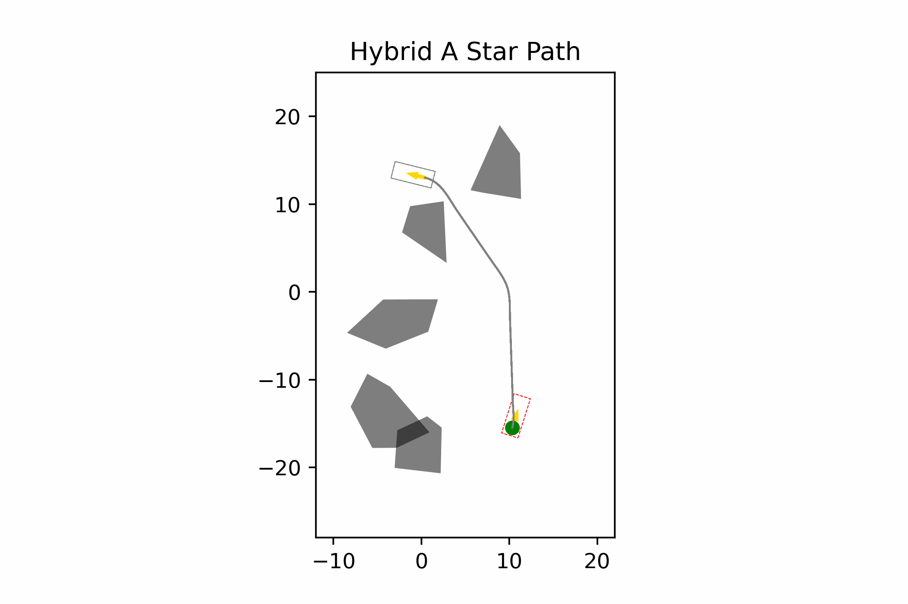
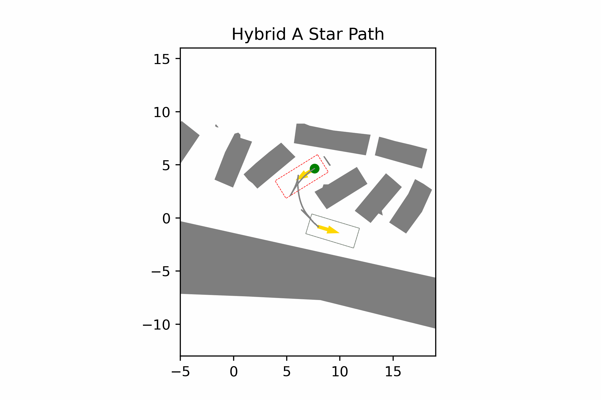

# Automated Valet Parking
## 1. Introduction
The purpose of this repo is to document my progress in this project.

This repo is developed based on [Wenqing's project](https://github.com/wenqing-2021/AutomatedValetParking). This readme only documents major changes made based on the original project. So for more details (system requirement, data structure, etc.) about this project, please visit the original project's page.

## 2. Usage
Run the following commands to install **requirements**
```
pip install -r requirements.txt

conda install -c conda-forge ipopt
```
---
Run *draw.py* to only draw the **map** of a certain case (default Case1)
```
python draw.py [--case_name=Case1]
```
Replace `Case1` with the benchmark case you want to draw.

---
Run *main.py* to show both the map and the **animation** process
```
python main.py [--case_name=Case1]
```
Again, replace `Case1` with the benchmark case you want to test.

## 3. Development Log

### 3.1 Visualization tools
#### 3.1.1 Draw Map
The `draw.py` draws only the maps of benchmark cases and saves them as CaseXMap.png. This facilitates debugging process by visualizing the benchmark cases.

Case 11 Map             |  Case 35 Map
:----------------------:|:----------------------:
 | 

As you can see, the initial position is indicated by the green rectangle and the goal indicated by the red one, with arrows indicating car's directions.

Drawing out maps gives us valuable information. E.g. Case 11 requires the car to find the parking slot in an open space after passing through obstacles, whereas Case 35 requires the car to park straight into a parking slot.

#### 3.1.2 Exploration Tracking
I also added the exploration tracking feature. During the animation, now we can see how the program is exploring the map in real time. 

The explored node is marked in red, and the small grey nodes are the nodes in the "open list" (neighbors waiting to be explored). 
Case 30 Exploration Start |  Case 16 Exploration End
:------------------------:|:----------------------:
 | 

This feature is helpful because it shows us how the program explores the map and where our resources are spent. E.g. In Case 16, although our program finally reaches the goal (following grey trace), it first explored in the wrong direction towards the top of the map.

### 3.2 Efficiency Improvement
By adjusting the heuristic calculation and cost configurations, I could further improve the search efficiency since my last commit.
- Case 9

Exploration Before | Exploration After
:-----------------:|:-----------------:
 | 
 | 

- Case 10

Exploration Before | Exploration After
:-----------------:|:-----------------:
 | 
 | 

### 3.3 Collision Check
An issue of the original implementation was that the program didn't properly check for situations where no path is found. This may lead to different kinds of issues. For example, in cases 27 and 30, no proper path can be found, so when a rs curve is found but it actually leads to a collision, the program uses it as the solution nonetheless and plans a path across walls.

Case 27 Path | Case 30 Path
:-----------------:|:-----------------:
 | 

I added checkers to check for these situations and properly handle them with error messages. 

A relevant but separate issue is that in cases like 7 and 13 (the reverse of cases 27 and 30, switching initial state and goal state), the path-planning exploration never ends.

After experimenting, I found a cause: the parking slot is too small, so the car may never be able to enter it since the car tries to avoid the obstacles in a grid map. It is easier to see how this situation is formed if we look at the reverse cases 27 and 30:
Case 27 Collision | Case 30 Collision
:-----------------:|:-----------------:
 | 
The car isn't able to enter/exit the parking slot, since it's already considered as "collided" by only standing in the parking slot. | When the car tries to move in any direction, a collision occurs.

Since the car cannot properly get out of the parking slot, it can neither get into the slot properly.

This problem could be relieved to some extent by reducing the `map_discrete_size`, `dt`, and `trajectory_dt` in `config.yaml`, so that more and denser nodes can be explored in the map. However, this would lead to a much larger amount of calculation.

### 3.4 Goal List
The original implementation uses a single point in the parking slot as the goal node for A* search. This might be inconvenient sometimes:
1. When the parking slot is surrounded by obstacles on 3 sides, which is a common situation, path-planning requires the rs curve to reach into a block of obstacles to find the goal node. But this is time-consuming and sometimes hard to complete.
2. When there are large obstacles between the intial state and the goal, rs curve doesn't work well, so our heuristic calculation would mainly depend on distance esitmation. But the accuracy of distance estimation varies a lot depends on how the obstacles are located. So we are likely to waste resources (time, energy...) in these cases.

*Replacing a single goal node with a list of goal nodes* could improve our performance in both cases. 

Goal nodes spreading around the original goal node makes our goal more reachable by rs curves, so better perfomance in case 1. 

For case 2, how our goal nodes spread can give us more information about how the environment is set up, so higher accuracy during distance estimation.

Here are some example:

- Case 5

Exploration Before | Exploration After
:-----------------:|:-----------------:
 | 
 | 

- Case 11

Exploration Before | Exploration After
:-----------------:|:-----------------:
 | 
 | 


### 3.5 Future Improvement
The current program sometimes generates unnatural turbulences in the planned paths:
Case 14 | Case 18
:-----------------:|:-----------------:
 | 

After some debugging, I found that the turbulence is mainly due to the wavy path produced in the path planning stage. But the "unnaturalness" mainly comes from the interpolation stage. Therefore, I would try to remove unnatural moves in the path by first investigating in `path_interpolation.py`. Then, to smooth the turbulences, I would look into the optimization files and maybe change the configurations for optimization. 
